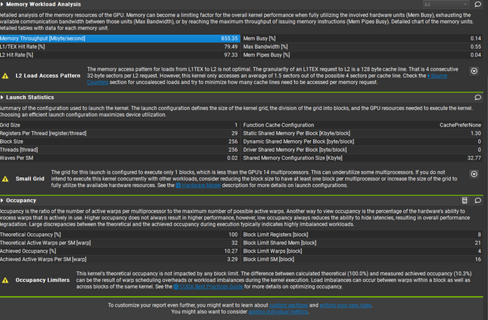

# CUDA Convolution

## What's Convolution?

Convolution is a mathematical operation frequently used in signal and image processing. In parallel programming, convolution can be parallelized to enhance performance, especially when dealing with large datasets. Here's a simplified example:

Let's consider a 1D convolution operation on an array of data “A” with a kernel “K”. The convolution operation can be represented as:

    C[i] = ∑(A[i+k]*K[k])

where “C” is the resulting convolution array, “A[i+k]” represents the element of the input array “A” at index “i+k”, and “K[k]” represents the element of the kernel “K” at index “k”.

To parallelize this operation, you can distribute the computation across multiple threads or processors. For example, you can divide the input array “A” into smaller segments and assign each segment to a separate thread. Each thread computes a portion of the convolution operation on its assigned segment concurrently. Finally, the results from all threads are combined to produce the final output array “C”.

In essence, parallel convolution involves dividing the input data and distributing the workload across multiple processing units to exploit parallelism and improve performance.

When employing padding same, the padding is applied in such a way that the output size matches the input size. This ensures that the convolution operation does not reduce the dimensions of the input data.

**Padding same**


### Definition

**Parallel convolution** is a technique used in parallel programming to compute convolution operations concurrently across multiple processing units, such as CPU cores or GPUs. By distributing the computation workload, parallel convolution aims to exploit parallelism and accelerate the processing of large datasets, enhancing overall performance.

## Basic Algorithm (Padding Same)
 
Our basic algorithm is a program that performs 2D convolution from global memory. It takes an input matrix representing the data to be convolved, while the kernel defines the convolution operation's weights. 
The actual convolution is executed by launching the CUDA kernel, convolution2DKernel. 
It iterates over each element of the output matrix and computes the convolution result by summing the element-wise multiplication of the input matrix with the corresponding kernel weights.

**Convolution Calculation:** For each output element, the kernel performs the convolution operation by summing the element-wise multiplication of the input matrix with the corresponding kernel weights.

**Boundary Handling:** To handle boundary conditions, the algorithm computes the appropriate input indices for each element of the kernel. It ensures that only valid input elements within the bounds of the input matrix are considered for the convolution operation.

```cuda
__global__ void convolution2DKernel(const float* input, const float* kernel, float* output,
    int inputWidth, int inputHeight,
    int kernelWidth, int kernelHeight) {
    int col = blockIdx.x * blockDim.x + threadIdx.x;
    int row = blockIdx.y * blockDim.y + threadIdx.y;

    if (col < inputWidth && row < inputHeight) {
        int halfKernelWidth = kernelWidth / 2;
        int halfKernelHeight = kernelHeight / 2;

        float result = 0.0f;

        for (int i = 0; i < kernelHeight; ++i) {
            for (int j = 0; j < kernelWidth; ++j) {
                int inputRow = row - halfKernelHeight + i;
                int inputCol = col - halfKernelWidth + j;

                if (inputRow >= 0 && inputRow < inputHeight && inputCol >= 0 && inputCol < inputWidth) {
                    result += input[inputRow * inputWidth + inputCol] * kernel[i * kernelWidth + j];
                }
            }
        }

        output[row * inputWidth + col] = result;
    }
}
```
## Optimization Algorithm (Padding Same)

We optimized the CUDA kernel function, `convolution2DKernelshared`, to improve the convolution operation with padding same by leveraging shared memory. Here's a breakdown of the optimizations we applied:

**Shared Memory Usage:** We utilized shared memory to store a tile of input data, along with additional halo elements for boundary conditions. By doing so, we reduced the number of global memory accesses, thereby improving memory bandwidth utilization.

**Thread Cooperation:** Threads within a thread block cooperated to load data into shared memory and compute the convolution result. This collaborative effort reduced redundant memory accesses and improved memory access patterns, leading to better performance.

**Halo Element Handling:** We loaded halo elements into shared memory to efficiently handle boundary conditions. These elements were accessed by threads within the thread block without requiring additional global memory accesses, contributing to more efficient computation.

**Loop Unrolling:** We unrolled the loop responsible for computing the convolution result to expose more parallelism and reduce loop overhead. This optimization strategy enhanced the efficiency of the computation process.

**Optimized Indexing:** We optimized indexing to ensure coalesced memory accesses and efficient memory access patterns. This adjustment further improved memory access efficiency, resulting in reduced memory latency.

Overall, these optimizations collectively enhanced memory access patterns, reduced memory latency, and improved the overall performance of the convolution operation with padding same.

```cuda
__global__
void convolution2DKernelshared(const float* input, const float* kernel, float* output,
    int inputWidth, int inputHeight,
    int kernelWidth, int kernelHeight) {
    __shared__ float inputTile[TILE_SIZE + 2][TILE_SIZE + 2]; // Input tile in shared memory
    int col = blockIdx.x * blockDim.x + threadIdx.x;
    int row = blockIdx.y * blockDim.y + threadIdx.y;
    int localRow = threadIdx.y;
    int localCol = threadIdx.x;

    // Indexing for shared memory
    int sharedRow = localRow + 1;
    int sharedCol = localCol + 1;

    // Load data into shared memory
    if (row < inputHeight && col < inputWidth) {
        inputTile[sharedRow][sharedCol] = input[row * inputWidth + col];

        // Load halo elements
        if (localRow == 0) {
            if (row > 0)
                inputTile[sharedRow - 1][sharedCol] = input[(row - 1) * inputWidth + col];
            else
                inputTile[sharedRow - 1][sharedCol] = 0.0f;
        }

        if (localRow == blockDim.y - 1) {
            if (row < inputHeight - 1)
                inputTile[sharedRow + 1][sharedCol] = input[(row + 1) * inputWidth + col];
            else
                inputTile[sharedRow + 1][sharedCol] = 0.0f;
        }

        if (localCol == 0) {
            if (col > 0)
                inputTile[sharedRow][sharedCol - 1] = input[row * inputWidth + col - 1];
            else
                inputTile[sharedRow][sharedCol - 1] = 0.0f;
        }

        if (localCol == blockDim.x - 1) {
            if (col < inputWidth - 1)
                inputTile[sharedRow][sharedCol + 1] = input[row * inputWidth + col + 1];
            else
                inputTile[sharedRow][sharedCol + 1] = 0.0f;
        }

        __syncthreads();

        float result = 0.0f;

        for (int i = 0; i < kernelHeight; ++i) {
            for (int j = 0; j < kernelWidth; ++j) {
                result += inputTile[sharedRow - kernelHeight / 2 + i][sharedCol - kernelWidth / 2 + j] * kernel[i * kernelWidth + j];
            }
        }

        output[row * inputWidth + col] = result;
    }
}
```

## Output Results of Each Algorithm

### Basic Algorithm 


### Optimization Algorithm


### MATLAB (Using MATLAB to verify the output, and my [MATLAB file](https://drive.matlab.com/sharing/d5eddc2a-8fc0-43bc-b82c-ad9cc0f90b60).)

**MATLAB Code:**

```matlab
% Input matrix
input = [3 3 2 1 0;
         0 0 1 3 1;
         3 1 2 2 3;
         2 0 0 2 2;
         2 0 0 0 1];

% Kernel
kernel = [0 1 2;
          2 2 0;
          0 1 2];

% Perform 2D convolution
result = conv2(input, rot90(kernel,2),"same");

disp('Result of 2D convolution:');
disp(result);
```


## Optimization Analysis

If you take a look at globalMem_Nsight_1 and sharedMem_Nsight_2 you will see the memory throughput.

**globalMem_Nsight_1:**


**sharedMem_Nsight_2:**



This is the main metric we used to see how effcient our optimization was. We used shared memory(tiling) as our enhancement.
What is memory throuput ? Memory thoroughput is the speed in which data is transferred between the GPU and the CPU.
This is good for convolution because at higher levels for example image processing or convolution neural networks. Sometimes large matrices are being convoleved a higher memory throughput allows for this process to be completed faster.
For global memory the memory throughput for the 2D convolution was 200 mb/s compared to the enhancement made with tiling which had a memoty thoughput of 800 mb/s.  

## Visual Studio Project
The Visual Studio project for this CUDA convolution implementation can be found [here](convolution2d/convolution2d.sln). The CUDA C code is located in the [kernel.cu](convolution2d/convolution2d/kernel.cu).

## License
The source code for the site is licensed under the MIT license, which you can find in the [MIT-LICENSE.txt](MIT-License.txt) file.
